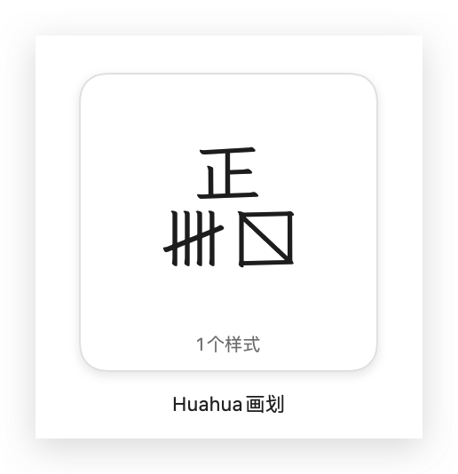
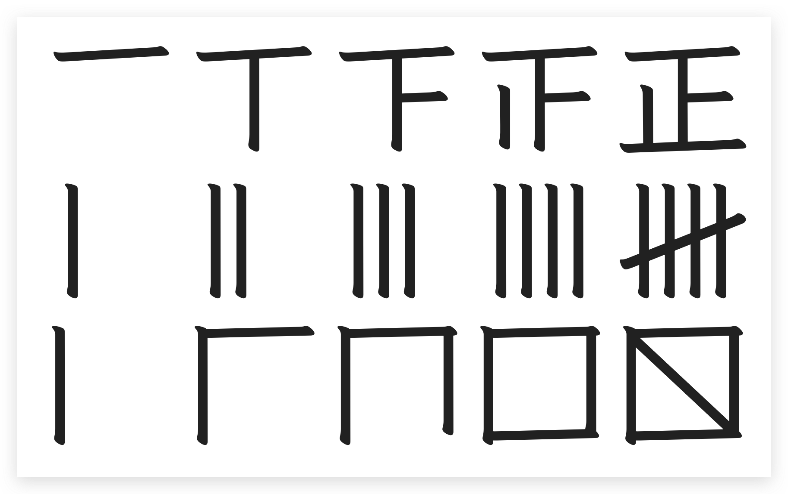
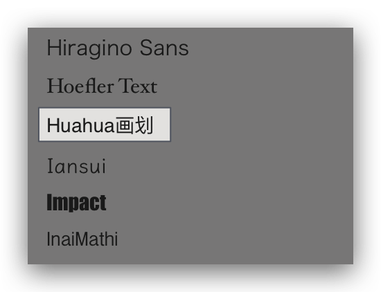
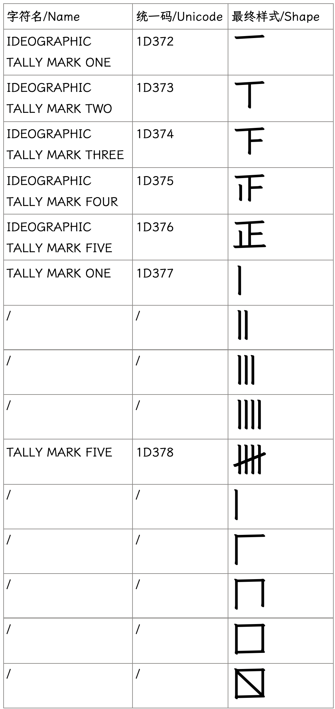
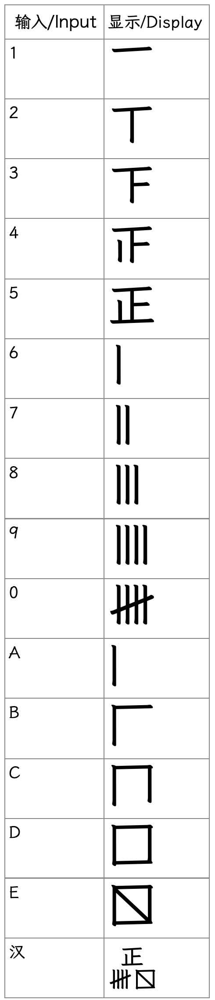

# Huahua画划 - 计数符号字体 / Tally Mark Font

🇨🇳**一个只有计数符号的字体。**

**🇬🇧A Font only contains Tally Marks.**

🇨🇳本字体基于霞鹜文楷风格，保留了原有的「正」字五个阶段，新增加了对于五条线和方框斜杠的支持。

安装好后，在Mac字体册你能看到这样的名字和预览。

🇬🇧This font is based on LXGW WenKai, keeps the original Hanzi 正's five stages and add support for five lines and bos slash.

After installation, you could find its name and preview in Mac's Fontbook.

🇨🇳在文本编辑器你能够看到这样的名字。

🇬🇧In the text editors you could find names like this.

## 字形 / Glyph

🇨🇳Unicode本身支持正字五个阶段+五条横线的最前最后两个阶段。

我直接保留了霞鹜文楷的正字五个阶段，在此基础上设计并补全了五条横线的阶段，以及方框斜杠的五个阶段。共计15个符号。

请注意这里面依然只有正字五个阶段和五条横线的两个阶段是涵盖在Unicode范围内的，其他八个都是自定义的字符。

请注意这里的“正”与汉字“正”编码不同，后者为6B63。

🇬🇧Unicode itself supports the five stages of the tally mark hanzi "正" and the first and last stages of the five-line tally mark.

I have directly preserved the five stages of the tally mark from LXGW WenKai and, on this basis, designed and completed the stages of the five-line tally mark, as well as the five stages of the box slash tally mark. In total, there are 15 symbols.

Please note that only the five stages of the tally mark and the two stages of the five-line tally mark are covered within the Unicode range and the other eight are custom characters.

Also, please note that the character "正" here is encoded differently from the hanzi "正" whose Unicode is 6B63.

 

🇨🇳同时为了方便打出来，我用常用字母和数字来表示这15个计数符号。

🇬🇧For convenience, I have used common letters and numbers to represent these 15 tally symbols.

## 许可 / License

SIL Open Font License 1.1
